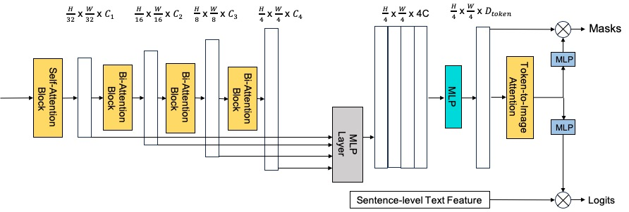

# Diffusion Encoder + Pixel Decoder + Mutiscale Decoder
The official PyTorch implementation of diffusion model as an image encoder, combined with Mask2Former's pixel decoder and a self-developed multi-scale decoder.

## Framework

Decoder (architecture refer to [Segformer](https://github.com/NVlabs/SegFormer/tree/master) and [SAM](https://github.com/facebookresearch/segment-anything) )
<p align="center">
  
</p>

## Preparation

1. Environment
   - [PyTorch](www.pytorch.org)
   - [Stable Diffusion dependencies](https://github.com/CompVis/stable-diffusion)
2. Datasets
   - The detailed instruction is in [LAVT](https://github.com/yz93/LAVT-RIS).
3. Pretrained weights
   - refer to [ODISE](https://github.com/NVlabs/ODISE)

## Train and Test

Training with 3 V-100s GPUs:
```shell
CUDA_VISIBLE_DEVICES=0,1,2 python -m torch.distributed.launch --nproc_per_node 3 train.py --model ldm --dataset refcoco --split train --batch-size 8 --epochs 40 --img_size 1024 --lr 0.0001 2>&1 | tee ./logs/refcoco/ldm_output
```
Testing
```shell
python test.py --model ldm --dataset refcoco --split testB --resume ./checkpoints/ldm_best_refcoco_unc.pth --img_size 1024
```
Babysitting
```shell
tensorboard --logdir ./logs/ldm_refcoco_train/ --port 6006
```
You can also refer to [LAVT](https://github.com/yz93/LAVT-RIS).

## License

This project is under the MIT license. See [LICENSE](LICENSE) for details.


Some code changes come from [CRIS](https://github.com/DerrickWang005/CRIS.pytorch/tree/master) and [LAVT](https://github.com/yz93/LAVT-RIS).
